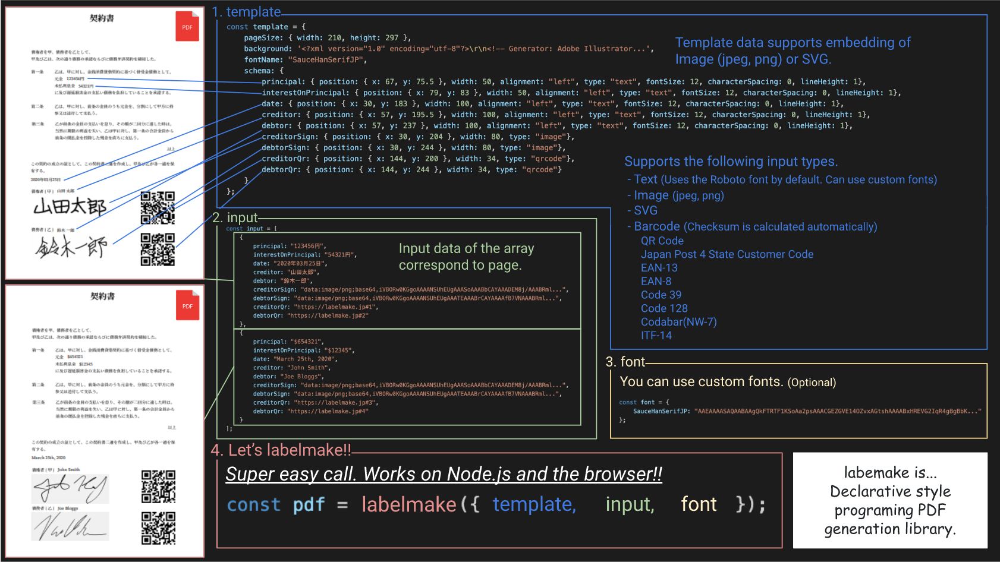
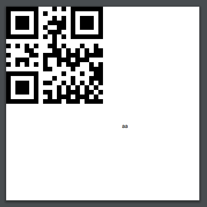

[](https://www.jsdelivr.com/package/npm/labelmake)

# labelmake



labelmake is a declarative style PDF generation library for Node and the browser.  
Specializes in variable data printing. makes easy to build an automatic typesetting system.

## Description

I just realised that Other PDF generation libraries makes program complex by imperative operations.

So, I developed this library aiming at a declarative style programing PDF generation library.

The result is a PDF based on templates and variable data, which makes the program very simple.

## Installation

Use [npm](https://www.npmjs.com/package/labelmake) to install the latest version.

```
npm install labelmake
```

You can use Yarn, NuGet or other methods as well. You can load it directly from [jsDelivr](https://www.jsdelivr.com/package/npm/labelmake).

## Usage

### Data

template

```json
{
    "background": null,
    "schema": {
      "test1": {
        "position": { "x": 0, "y": 0 },
        "width": 50,
        "type": "qrcode"
      },
      "test2": {
        "position": { "x": 60, "y": 60 },
        "width": 50,
        "alignment": "left",
        "fontSize": 8,
        "characterSpacing": 0,
        "type": "text",
        "lineHeight": 1
      }
    },
    "pageSize": {
      "width": 100,
      "height": 100
    }
};
```

input

```json
[{ "test1": "aa", "test2": "aa" }]
```

### Node

```js
const fs = require("fs");
const labelmake = require("labelmake");
const template = require("../template");
const input = require("../input");

labelmake({ input, template }).then(pdf => {
  fs.writeFileSync(__dirname + "/my.pdf", pdf);
});
```

### Browser

```html
<html>
  <iframe id="iframe" width="100%" height="700"></iframe>
  <script src="https://cdn.jsdelivr.net/npm/labelmake/dist/labelmake.min.js"></script>
  <script type="text/javascript" src="../template.js"></script>
  <script type="text/javascript" src="../input.js"></script>
  <script type="text/javascript">
    labelmake({ input, template }).then(buffer => {
      const blob = new Blob([buffer.buffer], { type: "application/pdf" });
      document.getElementById("iframe").src = URL.createObjectURL(blob);
    });
  </script>
</html>
```

### Result



You can see demo in [example](https://github.com/hand-dot/labelmake/tree/master/example) folder.

## Features

- Template data Template data supports embedding of Image (jpeg, png) and SVG.
- Input data supports the following input types.
  - Text(Uses the Roboto font by default. Can use custom fonts)
  - Image(jpeg, png)
  - SVG
  - Barcode(Checksum is calculated automatically)
    - QR Code
    - Japan Post 4 State Customer Code
    - EAN-13
    - EAN-8
    - Code 39
    - Code 128
    - Codabar(NW-7)
    - ITF-14

## Documentation

Please see the following page for more information

- [Developer guides(In development)](https://labelmake.jp/labelmake)
- [API Reference(In development)](https://labelmake.jp/labelmake)
