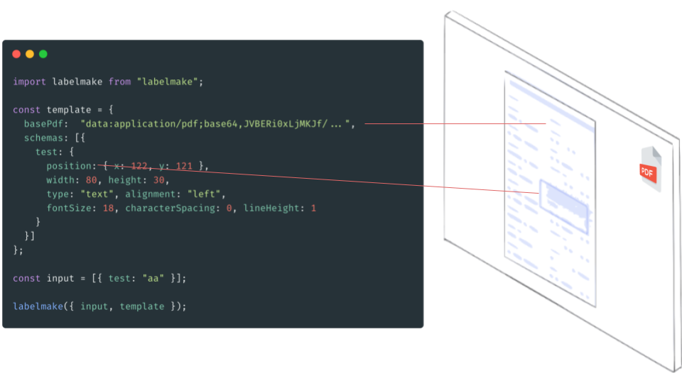

[](https://twitter.com/intent/tweet?text=JavaScript%20PDF%20Library.%20Works%20on%20Node%20and%20Browser!!&hashtags=JS,PDF&url=https://labelmake.jp/javascript-pdf-generator-library&via=labelmake)


[](https://www.jsdelivr.com/package/npm/labelmake)


# [labelmake](https://labelmake.jp/javascript-pdf-generator-library)

[](https://labelmake.jp/javascript-pdf-generator-library)

labelmake is a declarative style PDF generation library for Node and the browser.

> Other PDF generation libraries makes program complex by imperative operations. So, I developed this library aiming at a more simple declarative style PDF generation library.
> Finally, the layout engine and [design & code generator tools](https://labelmake.jp/javascript-pdf-generator-library/template-design) make PDF generation so easy!

## **Learn more at [official website](https://labelmake.jp/javascript-pdf-generator-library)**

---

## Installation

Use [npm](https://www.npmjs.com/package/labelmake) to install the latest version.

```
npm install labelmake
```

You can use Yarn, NuGet or other methods as well. You can load it directly from [jsDelivr](https://www.jsdelivr.com/package/npm/labelmake).

## Features

- Input data supports the following input types.
  - Text
    - Custom font
    - Styling(size, color, aliginment, etc.)
  - Image
    - JPG
    - PNG
  - Barcode
    - QR Code
    - Japan Post 4 State Customer Code
    - EAN-8, EAN-13
    - Code 39, Code 128
    - Codabar(NW-7)
    - UPC-E, UPC-A

## [Demo](https://labelmake.jp/javascript-pdf-generator-library/example)

[](https://labelmake.jp/javascript-pdf-generator-library/example)

- [Simple](https://labelmake.jp/javascript-pdf-generator-library/example#labelmake-example)
- [Custom font](https://labelmake.jp/javascript-pdf-generator-library/example#labelmake-example-customfont)
- [Barcode](https://labelmake.jp/javascript-pdf-generator-library/example#labelmake-example-barcode)
- [Embed PDF & Image](https://labelmake.jp/javascript-pdf-generator-library/example#labelmake-example-embedpdf)
- [Embed MultiPage PDF](https://labelmake.jp/javascript-pdf-generator-library/example#labelmake-example-multipage)

## [Development tools](https://labelmake.jp/javascript-pdf-generator-library/template-design)

[](https://labelmake.jp/javascript-pdf-generator-library/template-design)

Templates can be customized with design tools. and code can be generated with a generator.

## [API Reference](https://labelmake.jp/javascript-pdf-generator-library/api)

[](https://labelmake.jp/javascript-pdf-generator-library/api)

Detailed specifications can be found in the api documentation.

## [Services that are used in Production](https://labelmake.jp/)

[](https://labelmake.jp/)

[labelmake.jp](https://labelmake.jp/) - variable data printing service.(Japanese)

## Author

[@hand-dot](https://github.com/hand-dot)

labelmake is based on a amazing library [pdf-lib](https://github.com/Hopding/pdf-lib)[(@Hopding)](https://github.com/Hopding).

Thanks to all contributors.

## License

[MIT](LICENSE.md)
